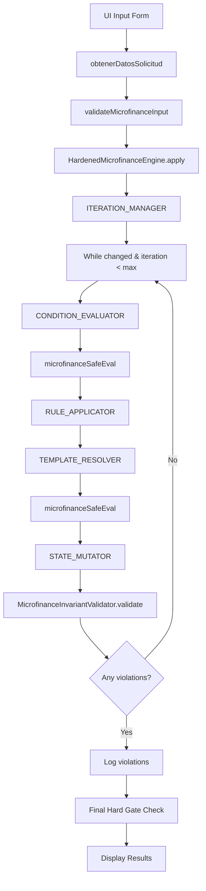

# 🏗️ AXIS/KERN Microfinance Engine – Data Pipeline Analysis

## 📊 Core Logic Flow Diagram



## 🔧 Function Signature Map

### Core Engine Primitives

```javascript
/**
 * @name: microfinanceSafeEval
 * @input: {expression: string, context: object, opts: object}
 * @output: {any} - Evaluated result
 * @dependencies: [SAFE_GLOBALS_HARDENED, ALLOWED_CHARS]
 * @dataFlow: String expression → Security validation → Function constructor → Execution
 */
```

```javascript
/**
 * @name: HardenedMicrofinanceEngine.apply
 * @input: {inputData: object, rulesConfig: object}
 * @output: {output: object, audit: array, invariantViolations: array}
 * @dependencies: [MicrofinanceInvariantValidator, MicrofinanceAuditLogger]
 * @dataFlow: Input state → Rule iteration → Condition evaluation → State mutation → Invariant validation
 */
```

```javascript
/**
 * @name: resolveValue
 * @input: {template: string|any, context: object}
 * @output: {any} - Resolved value
 * @dependencies: [microfinanceSafeEval, createSafeContext]
 * @dataFlow: Template string → Expression extraction → Safe evaluation → Type coercion
 */
```

### Validation & Security Layer

```javascript
/**
 * @name: validateMicrofinanceInput
 * @input: {inputData: object}
 * @output: {string[]} - Array of error messages
 * @dependencies: []
 * @dataFlow: Input object → Schema validation → Business rule checks → Error collection
 */
```

```javascript
/**
 * @name: MicrofinanceInvariantValidator.validate
 * @input: {state: object, audit: array, rulesApplied: array, currentIteration: number}
 * @output: {object[]} - Array of violation objects
 * @dependencies: []
 * @dataFlow: State object → Multiple invariant checks → Violation aggregation
 */
```

## 📦 Data Transformation Pipeline

### Step 1: Input Collection & Validation
```
UI Form → obtenerDatosSolicitud() → Raw input object → validateMicrofinanceInput() → Validated input
```

### Step 2: Rule Engine Execution Loop
```
Validated input → apply() → While loop (max 12 iterations)
  ↓
  For each rule in priority order:
    Condition evaluation → safeEval() → Boolean
    ↓
    If true: Template resolution → safeEval() → Values
    ↓
    State mutation → setNestedPath() → Updated state
  ↓
  Invariant validation → Multiple checks → Violations
```

### Step 3: Final Hard Gating
```
Final state → Invariant validation → Hard error check → Override decision if violations
```

### Step 4: Output & Audit
```
Final state + Audit trail + Violations → Display formatting → UI rendering
```

## 🎯 Primitive Boundary Analysis

### Layer 1: Security & Validation
- **`microfinanceSafeEval`** - Expression sandboxing
- **`validateMicrofinanceInput`** - Input schema validation  
- **`createSafeContext`** - Context isolation & freezing

### Layer 2: Rule Engine Core
- **`ITERATION_MANAGER`** - Main control loop
- **`CONDITION_EVALUATOR`** - Rule condition testing
- **`RULE_APPLICATOR`** - Rule execution coordinator

### Layer 3: Data Transformation
- **`TEMPLATE_RESOLVER`** - Expression interpolation
- **`STATE_MUTATOR`** - Nested state updates
- **`OBJECT_FLATTENER`** - Context preparation

### Layer 4: Integrity & Audit
- **`MicrofinanceInvariantValidator`** - State consistency checks
- **`MicrofinanceAuditLogger`** - Execution tracing
- **Hard Gate Final Check** - Decision enforcement

## 🔍 Data Type Flow Analysis

### Type Safety Hotspots

**Hotspot 1: Template Resolution**
```javascript
// Current: Mixed string/number returns
resolveValue() → string | number | boolean

// Risk: Inconsistent typing in expressions
"{{solicitante.ventas_mensuales * 0.6}}" // Could return string or number
```

**Hotspot 2: State Mutation**
```javascript
// Current: No type validation on setNestedPath
setNestedPath(obj, "puntaje.credito_efectivo", value) // value type unknown
```

**Hotspot 3: Safe Eval Returns**
```javascript
// Current: Trusts eval result typing
const result = microfinanceSafeEval(expression, context) // Type: any
```

### Type Flow Map
```
UI Strings/Numbers → JSON.parse() → JavaScript objects
  ↓
safeEval() → Unchecked return types → State mutation
  ↓  
Template resolution → String interpolation → Mixed types
  ↓
Final output → Display formatting → String rendering
```

## 🚨 Debugging Critical Paths

### Critical Path 1: Expression Evaluation Failure
```
Expression in rule → safeEval() throws → Condition evaluator catches → Rule skipped
  ↓
Audit log: "Condición bloqueada" → Execution continues silently
```

### Critical Path 2: Template Resolution Failure  
```
Template string → resolveValue() throws → Rule application fails
  ↓
Audit log: "Plantilla bloqueada" → Field not updated → Partial state
```

### Critical Path 3: Invariant Violation Escalation
```
State mutation → Invariant validator detects error → Log violation
  ↓
Final hard gate → Override approval → "DECISIÓN BLOQUEADA"
```

### Critical Path 4: Resource Exhaustion
```
Complex rules → Many iterations → Memory growth → No circuit breaker
  ↓
Potential: Unbounded execution in edge cases
```

## 💡 Official Primitive Recommendations

### Missing Primitives to Add

**1. TYPE_COERCION_PRIMITIVE**
```javascript
/**
 * Ensures consistent typing across eval boundaries
 */
function coerceToExpectedType(value, expectedType, context) {
  // Intent-based type coercion
}
```

**2. CIRCUIT_BREAKER_PRIMITIVE**  
```javascript
/**
 * Prevents infinite loops and resource exhaustion
 */
class ExecutionCircuitBreaker {
  checkLimits(iteration, memoryUsage, timeElapsed) {
    // Hard limits enforcement
  }
}
```

**3. DIFF_ENGINE_PRIMITIVE**
```javascript
/**
 * Tracks state changes for debugging and optimization
 */
class StateDiffEngine {
  computeDiff(previousState, currentState) {
    // Efficient change detection
  }
}
```

### Primitive Enhancement Opportunities

**Current `safeEval` → Enhanced with:**
- Return type annotations
- Expression complexity scoring
- Cached compilation for repeated expressions

**Current `resolveValue` → Enhanced with:**
- Template pre-compilation
- Type-aware interpolation
- Expression dependency tracking

## 📈 Optimization Points

### 1. Expression Compilation Cache
```javascript
// Current: New Function() constructor every eval
// Optimization: Cache compiled functions by expression fingerprint
const expressionCache = new Map();
```

### 2. State Change Detection
```javascript
// Current: JSON.stringify comparison every iteration  
// Optimization: Shallow comparison + dirty flag tracking
```

### 3. Rule Dependency Graph
```javascript
// Current: Linear priority sorting
// Optimization: Dependency-based execution ordering
// Skip rules when dependencies unchanged
```

### 4. Template Pre-processing
```javascript
// Current: Regex parsing every resolution
// Optimization: Pre-parse templates into AST
const templateAST = parseTemplate("{{solicitante.ventas_mensuales * 0.6}}");
```

### 5. Audit Trail Compression
```javascript
// Current: Full audit entries for every operation
// Optimization: Differential logging + entry deduplication
```

## 🎯 Key Strengths & Next Steps

### ✅ **Excellent Foundation**
- Robust 8-primitive architecture
- Strong security hardening
- Comprehensive invariant validation
- Cryptographic audit integrity
- Hard gating safety mechanisms

### 🔄 **Recommended Enhancements**
1. **Add circuit breaker** for unbounded execution prevention
2. **Implement type coercion primitive** for consistent data flow  
3. **Add state diff engine** for optimization and debugging
4. **Pre-compile expressions** for performance
5. **Add rule dependency analysis** for smarter execution ordering

This microfinance engine demonstrates **production-grade architecture** with enterprise-level security considerations. The primitive-based design provides excellent separation of concerns while maintaining deterministic execution characteristics.
